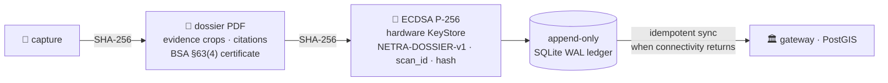
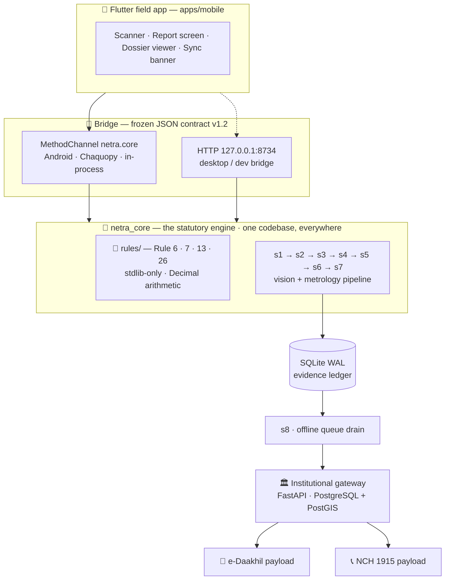

<div align="center">

# 👁️ NETRA · नेत्र

### One photograph → a deterministic statutory audit → a signed, court-shaped violation dossier

**Offline-first compliance engine for the Legal Metrology (Packaged Commodities) Rules, 2011** · India

[](https://github.com/varun2507027108-oss/NETRA/actions/workflows/ci.yml)
[](https://github.com/varun2507027108-oss/NETRA/actions)
[](LICENSE)
[](#-the-pipeline--all-8-spec-stages-live)
[](#-testing)
[](docs/BRIDGE_CONTRACT.md)
[](https://github.com/varun2507027108-oss/NETRA/releases)

***netra* (नेत्र) — Sanskrit: "the eye."** The inspector's eye that never tires, never blinks,
and reads font heights in fractions of a millimetre.

</div>

---

## 📋 The problem

> 📦 **Tens of millions** of pre-packaged SKUs circulate across Indian retail, every single day.
> 🔍 Legal metrology inspectors manually reach **less than 0.01%** of them.
> 👁️ The violations are **sub-visual** — a 1.2 mm numeral, a missing *"incl. of all taxes"*, a ₹/g price that doesn't divide, *"gms"* printed instead of *"g"*.

**NETRA** turns one smartphone photograph into a full deterministic audit of every machine-checkable statutory declaration — then files a cryptographically signed, court-shaped dossier that survives zero-connectivity kirana basements and syncs to the institutional gateway when the network returns.

| | |
|---|---|
| 🧠 **Deterministic, not probabilistic** | the legal decision path is rules + `Decimal` arithmetic — same input, same verdict, every time. ~0.45 ms. |
| ✈️ **Offline-first** | the network only ever touches the queue drain; a scan with zero bars behaves identically to one on 5G |
| ⚖️ **Court-shaped evidence** | SHA-256 chain → hardware-backed ECDSA P-256 → §63(4) BSA certificate → lifecycle-managed evidence ledger |
| 🏛️ **Institutional integration** | e-Daakhil & NCH 1915 payloads, PostGIS violation heatmaps for inspector route planning |

---

## ⚙️ The pipeline — all 8 spec stages, live

| # | Stage | What it does | Live engine today | Device-round upgrade | Budget |
|---|---|---|---|---|---|
| 1 | ✅ **s1 · quality gate** | Laplacian ≥ 100 blur gate, glare > 242, inspector repositioning prompts | OpenCV | — | < 3 ms |
| 2 | ✅ **s2 · geometry** | package silhouette, fiducial-aware crop, shape suggestion, barcode ROI | classical CV | YOLO26n on LiteRT | ~39 ms |
| 3 | ✅ **s3 · calibration** | ArUco homography + solvePnP → mm/px, cylindrical unwarp, Rule 7(4) PDA | OpenCV | + TPS pouch correction | ~15 ms |
| 4 | ✅ **s4 · OCR** | 3-tier router — first engine with tokens wins | registry + Tesseract *(desktop dev tier)* | ML Kit v2 · IndicPhotoOCR · Bhashini | < 1 ms routing |
| 5 | ✅ **s5 · extraction** | anchor→value spatial aggregation (L1–L4), typed-parse gating | deterministic K-NN heuristics | — | < 1 ms |
| 6 | ✅ **s6 · metrology** | Table-I font heights, glyph aspect, USP math, Rule 6/13/26 | stdlib + `Decimal` | — | < 1 ms |
| 7 | ✅ **s7 · dossier** | evidence PDF, hash chain, §63(4) certificate page | ReportLab | platform KeyStore signing | ~20 ms |
| 8 | ✅ **s8 · sync** | offline queue drain → gateway → institutional exports | stdlib urllib + SQLite | — | async |

<details>
<summary><b>📐 Statutory depth — what the rule engine actually encodes</b></summary>

**Table-I minimum font heights (Rule 7, G.S.R. 629(E)):**

| Principal Display Area | Normal print | Blown / molded / embossed |
|---|---|---|
| ≤ 50 cm² | 1.0 mm | 1.5 mm |
| 50 – 100 cm² | 1.5 mm | 3.0 mm |
| 100 – 500 cm² | 2.5 mm | 4.0 mm |
| 500 – 2500 cm² | 4.0 mm | 6.0 mm |
| > 2500 cm² | 6.0 mm | 6.0 mm |

**Character width (Rule 7(3)):** width ≥ height/3 — statutory exemptions for `1`, `i`, `I`, `l` only.

**Unit Sale Price (Rule 6(11)):** ₹/g below 1 kg, ₹/kg above · ₹/ml below 1 L, ₹/L above · ₹/cm below 1 m, ₹/m above · **|declared − calculated| ≤ ₹0.01** · exactly-one-unit exemption.

**Prohibited syntax (Rule 13):** `gms`, `grm`, `kilo`, `kgs`, `ltr`, `cc`, `cu.cm`, `pkts`, `doz` → automatic violation.

**Exemptions (Rule 26):** ≤ 10 g/mL (except tobacco, bidi, pan masala) · > 25 kg/L bulk (except cement & fertilizers up to 50 kg) · institutional supply · fast-food packaging.

**Origin (Rule 6(1)(aa)):** "Made in PRC" fails — an explicit country is required.

All of it is unit-tested at the statutory boundaries: the PDA band edges, the ₹0.01 tolerance, the 1000 g = 1 kg exemption, the tobacco and cement carve-outs.
</details>

---

## 🔐 The evidence chain



- The signature covers the exact payload `"NETRA-DOSSIER-v1|<scan_id>|<pdf_sha256>"` — pinned in Python, in Kotlin, and in a tripwire test
- The certificate page cites **§63(4), Bharatiya Sakshya Adhiniyam, 2023** — the provision that replaced §65B(4) of the Indian Evidence Act
- The core **never holds private keys**; signing happens on the capture device, and NETRA never signs for a person
- The ledger is **append-only**: re-sync is idempotent, rejected envelopes surface for a human, evidence is never deleted

---

## 🧭 Architecture



**Design principles, in one table:**

| Principle | Why |
|---|---|
| 🧮 Deterministic over probabilistic | no LLM in the verdict path — 0.45 ms, auditable, cross-examinable, offline |
| 📦 The rules layer is stdlib-only | identical code in pytest, in the desktop bridge, and inside Chaquopy on Android |
| 💰 Money & quantities are `Decimal` end-to-end | crossing the bridge as *strings* — no float ever touches statutory arithmetic |
| 📜 The bridge contract is law | 17-key result schema, machine-validated by `netra_core.qa.contract` — drift is a test failure, not a debate |
| 🛟 Never worse than status quo | every CV stage degrades to a no-op when unsure — cluttered scene → no crop, pipeline proceeds |

---

## 🖥️ Quick start

**Windows** (the reference environment):

```bash
git clone https://github.com/varun2507027108-oss/NETRA
cd NETRA/core

python -m venv .venv
.venv\Scripts\python -m pip install -e ".[dev]"
.venv\Scripts\python -m pip install -e ..\backend

.venv\Scripts\python scripts\doctor.py        # 🩺 environment report — what's ready, what's missing
.venv\Scripts\pytest                          # 🧪 323 tests
.venv\Scripts\python scripts\demo_all.py      # 🎬 the full 8-stage story, one command
```

<details>
<summary><b>🐧 Linux / macOS variant</b></summary>

```bash
git clone https://github.com/varun2507027108-oss/NETRA
cd NETRA/core

python3 -m venv .venv
source .venv/bin/activate
pip install -e ".[dev]"
pip install -e ../backend

sudo apt-get install -y tesseract-ocr tesseract-ocr-eng libgl1 libglib2.0-0  # desktop OCR tier

python scripts/doctor.py
pytest
python scripts/demo_all.py
```
</details>

<details>
<summary><b>🖨️ Printing the fiducial card</b></summary>

```bash
.venv\Scripts\python scripts\make_fiducial_card.py
```

Print at **100% scale** (no fit-to-page). The 40 mm ArUco marker is what Stage 3 uses to recover
millimetre-per-pixel scale — hold it flat against the package, adjacent to the label.
</details>

---

## 🎬 The demo — what one command shows

`scripts/demo_all.py` runs the complete narrative against a label with **five planted statutory traps** — the exact sub-visual non-compliances the problem statement describes:

| Planted on the label | Rule fired | NETRA's finding |
|---|---|---|
| `Net Quantity: 200 gms` | Rule 13 | prohibited symbol — statutory is `g` |
| `MRP ₹ 14.00` *(no tax phrase)* | Rule 6(1)(e) | missing *"incl. of all taxes"* |
| `Unit Sale Price ₹ 0.35 / g` | Rule 6(11) | math error — MRP ÷ qty = ₹0.20, tolerance ₹0.01 |
| `Made in PRC` | Rule 6(1)(aa) | ambiguous origin — an explicit country is required |
| 1.2 mm numerals on an 80 cm² PDA | Rule 7 | below the 1.5 mm Table-I minimum |

```text
$ .venv/Scripts/python scripts/demo_all.py

=== 1 · THE SCAN — five planted statutory traps =========================
verdict: VIOLATION   (7 FAIL / 4 PASS / 0 NA · 0.9 ms)
  [FAIL] Rule 13       Prohibited unit syntax 'gms' — statutory symbol 'g' required
  [FAIL] Rule 6(1)(e)  MRP non-compliant — missing 'inclusive of all taxes'
  [FAIL] Rule 6(11)    USP math error — declared Rs 0.35 vs calculated Rs 0.20
  [FAIL] Rule 6(1)(aa) Ambiguous origin 'PRC' — explicit country required
  [FAIL] Rule 7        Net quantity: 1.20 mm vs required 1.5 mm (PDA 80 cm²)

=== 2 · THE DOSSIER =====================================================
pdf    : core/demo_output/netra/dossiers/netra_8a99d2a2...pdf
sha256 : 3920cb89db02a5045e2776f2e3193e6a...

=== 3 · THE SIGNATURE — hardware-backed ECDSA P-256 =====================
result : accepted=True verified=True status=signed

=== 4 · THE OFFLINE LEDGER ==============================================
ledger : {"total": 1, "pending_sync": 1, "signed": 1, "dossiers": 1}

=== 7 · THE EXPORTS — e-Daakhil & NCH 1915 ==============================
e-Daakhil: respondent 'Global Foods', 7 violations, evidence-linked
NCH 1915 : pin zone Maharashtra / Madhya Pradesh / Goa / Chhattisgarh

=== 8 · THE NUMBERS =====================================================
statutory core (s5+s6, 25-run mean): 0.45 ms
```

**Open the PDF.** Red evidence boxes over every failing declaration, rule citations under every finding, and the §63(4) certificate page — that's the artifact an evaluator remembers.

---

## 🧪 Testing

| | |
|---|---|
| ✅ **353 tests** | green on GitHub Actions, Python 3.11 + 3.13 — the CI run is the canonical test count · [the badge is live](https://github.com/varun2507027108-oss/NETRA/actions) |
| 🎯 **Statutory boundary tests** | PDA band edges (50/100/500/2500 cm²) · the ₹0.01 USP tolerance · the exactly-one-unit exemption · tobacco & cement carve-outs · "Made in PRC" |
| 📜 **Executable contract validators** | every payload shape the core emits is validated in-test; Flutter mock fixtures are machine-validated at record time (`core/fixtures/contract/`) |
| 🏞️ **Golden-report engine** | photograph real packages → per-fixture rule precision/recall (`core/fixtures/README.md`) |
| 🩺 **Environment doctor** | `scripts/doctor.py` — one command, every dependency, fix hints |

---

## 📁 Repository layout

<details>
<summary><b>Expand the tree</b></summary>

```
NETRA/
├── core/                    🧠 netra_core — the statutory engine (Python)
│   ├── netra_core/
│   │   ├── rules/           Rule 6 · 7 · 13 · 26 — stdlib-only, fully unit-tested
│   │   ├── stages/          s1…s7 pipeline stages
│   │   ├── ocr/             Tesseract desktop adapter (line-token normalization)
│   │   ├── dossier/         PDF builder + evidence-chain crypto
│   │   ├── persistence/     SQLite WAL evidence ledger
│   │   ├── sync/            offline queue drain + e-Daakhil/NCH exporters
│   │   ├── bridge/          the frozen JSON contract, FastAPI + Chaquopy seams
│   │   ├── vision/          ArUco, geometry, calibration helpers
│   │   └── qa/              golden-report engine + executable contract validators
│   ├── tests/               353 tests
│   ├── scripts/             doctor · demo_all · bench · fiducial card · fixtures · payload checker
│   └── fixtures/            contract mocks (committed) · real-photo validation protocol
├── backend/                 🏛 institutional gateway — FastAPI · SQLAlchemy · PostGIS
├── native/android/          🔌 the platform seam — NetraCorePlugin.kt · NetraKeystore.kt · smoke spike
├── apps/mobile/             📱 Flutter field app (built against the bridge contract)
└── docs/                    📚 everything below
```
</details>

---

## 📚 Documentation

| Doc | What's inside |
|---|---|
| [`docs/BRIDGE_CONTRACT.md`](docs/BRIDGE_CONTRACT.md) | the frozen JSON seam between core and Flutter — **it is law** |
| [`docs/SUBMISSION.md`](docs/SUBMISSION.md) | the evaluation brief — verify the whole system in ten minutes |
| [`docs/DEMO_SCRIPT.md`](docs/DEMO_SCRIPT.md) | the timed 5-minute judge demo, with contingency insurance |
| [`docs/JUDGE_QA.md`](docs/JUDGE_QA.md) | 13 anticipated judge questions, answered honestly |
| [`docs/ANDROID_INTEGRATION.md`](docs/ANDROID_INTEGRATION.md) | the Chaquopy spike, the native seam, the Path A/B decision tree |
| [`core/fixtures/README.md`](core/fixtures/README.md) | the real-photo validation protocol |

---

## 🗺️ Roadmap

- [x] Deterministic 8-stage pipeline — every spec stage live on the deterministic engine
- [x] Evidence chain: dossier → ECDSA P-256 → lifecycle-managed ledger → sync → exports
- [x] Bridge contract v1.3.2 + executable validators + machine-validated Flutter mocks
- [x] CI green — 353 tests, Python 3.11 & 3.13
- [x] Android native seam — MethodChannel pipe, KeyStore signer, environment spike
- [x] Chaquopy device spike → Path B1 confirmed (numpy/reportlab/pillow on-device; s7 live)
- [ ] On-device OCR — ML Kit v2 + IndicPhotoOCR via the Chaquopy Java bridge
- [ ] Real-photo golden report — measured rule precision / recall
- [ ] YOLO26n provider for PDP / BOP / PRICE ROIs
- [ ] Flutter field app — scanner, report, dossier signing, sync

---

<div align="center">

**Made with** 🐍 Python · 🔷 OpenCV · 📄 ReportLab · ⚡ FastAPI · 🐦 Flutter · 🤖 Chaquopy · 🗄️ SQLite + PostGIS

---

**Smart India Hackathon 2025** · Problem **SIH26034**

Ministry of Consumer Affairs, Food & Public Distribution — Department of Consumer Affairs / Legal Metrology Division

⭐ *Star this repo if the evidence chain impressed you*

</div>
